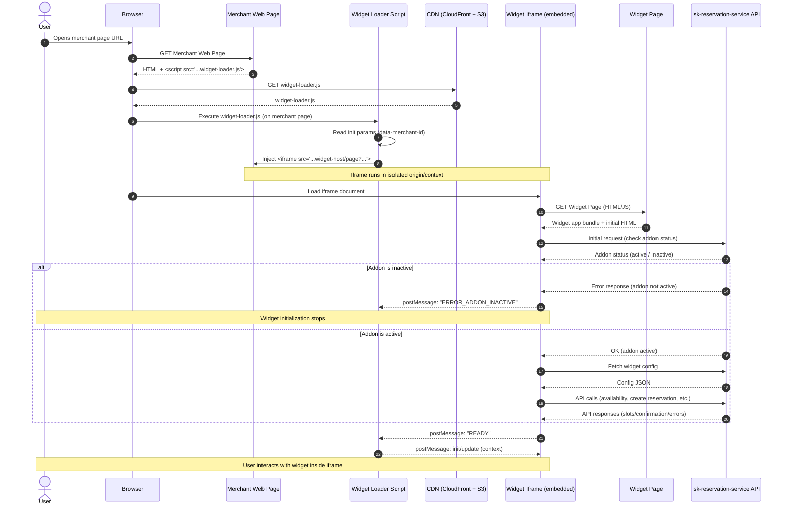

# 81. Lightspeed Reservation Widget

**Owner(s):**

- Vladislav Khripkov, Andrei Kim

**Created:** 2026-02-19

**Status:** In Review

## What are you trying to solve?

Guests want a simple way to book reservations directly from the merchant website without leaving the page. The current process involves redirecting to our reservation site (`lightspeed.app/reservation/{merchant-id}`), which creates several problems:

- **High drop-off rates**: Users abandon the booking flow when redirected to external sites
- **Fragmented user experience**: Breaking the merchant's website flow reduces conversion. It also increases time for booking flow
- **Competitive disadvantage**: Competitors like OpenTable, Resy, and SevenRooms offer embeddable widgets

Currently, merchants are using third-party reservation services and their widgets. Now that we have launched Lightspeed Reservations, we should offer widget functionality. This would make it easier for merchants to switch to our reservation service. This proposal aims to provide an embeddable widget that keeps users on the merchant's website throughout the entire booking process.

## What are you proposing?

We will develop a customizable, embeddable JavaScript widget that merchants can easily integrate into their websites. This widget will communicate with our existing Reservation API.

### Key Features

- **Booking Form**: A simple, multi-step form for guest information
- **Instant Confirmation**: Immediate booking confirmation with email notification
- **Customization**: Merchants can configure widget appearance and behavior
- **Responsive Design**: Works seamlessly on desktop and mobile devices


### Technical Decisions

Based on analysis of competitor solutions (OpenTable, Resy, SevenRooms, TheFork) and technical feasibility, we've chosen:

- **Delivery Method**: Loader script, that injects an iframe pointing to a new, widget-specific page
- **Configuration**: Customization via backoffice (+ special `data-*` attribute for identification of the merchant)
- **Browser Support**: See [Browser and Device Compatibility](#risks-browser-compatibility) in Risks section

### Widget Delivery

**Chosen Approach: Embedded Widget via Loader Script (Iframe-based)**

The widget will be delivered in two parts:

1. **Loader Script**: A lightweight JavaScript file. Storing (+ versioning) and delivering on S3 and CloudFront
2. **Widget Application**: An iframe pointing to a new, widget-specific page

**Implementation:**

Merchants will add a single async script tag to their website:

```html
<script
    async
    src="https://order-ahead.sbx.lsk.lightspeed.app/reservation/widget-loader.js"
    data-merchant-id="123"
></script>
```

The loader script will:

1. Create an iframe pointing to `https://order-ahead.sbx.lsk.lightspeed.app/reservation/{merchant-id}/widget`
2. Inject the iframe into the merchant's page
3. Expose an API for interacting with the iframe via postMessage. For example, customization elements or subscription to events inside the iframe (e.g. open/close widget state).

With the async property, we would not interrupt the customer's website, as some of them care about website performance.

Using `data-*` attributes on the script tag will help with caching (instead of using query params).

If needed, it is also possible to add versioning for the loader script. In this case, the merchant would need to update their script to use the new features.

### Implementation Details

**Loader Script Technology Stack:**

- **Build Tool**: Vite (Library Mode)
- **Language**: TypeScript
- **Target**: ES2022 (Compatible with 94%+ of global browsers).

An implementation example for a loader script would look like this:

```javascript
(function (w, t, c, p, s, e) {
    p = new Promise(function (r) {
        w[c] = {
            client: function () {
                if (!s) {
                    s = document.createElement(t);
                    s.src =
                        "https://order-ahead.sbx.lsk.lightspeed.app/reservation/widget-loader.js";
                    s.async = 1;
                    s["data-merchant-id"] = "123";
                    s.crossOrigin = "anonymous";
                    e = document.getElementsByTagName(t)[0];
                    e.parentNode.insertBefore(s, e);
                    s.onload = function () {
                        r(w[c]);
                    };
                }
                return p;
            },
        };
    });
})(window, "script", "LSReservationWidget");
```

It will create LSReservationWidget object, that will provide some API for merchant to interact with widget.

```html
<script>
    const openButton = document.querySelector(".some-random-button");
    openButton.addEventListener("click", async () => {
        const lsReservationWidget = await LSReservationWidget.client();
        lsReservationWidget.open();
    });
</script>
```

**Widget Technology Stack:**

- The same as the existing reservation app.

**Why Iframe Approach:**

- **Security**: Better isolation between merchant site and widget
- **Faster Development**: Reuses existing reservation infrastructure
- **Easier Maintenance**: Widget updates don't require merchant code changes, we release changes for reservation guest website and for widget at the same time
- **Proven Pattern**: Used successfully by competitors (OpenTable, TheFork, Zenchef)
- **Easy to install**: Merchants only need to add a loader script. No need to manage configuration and settings of iframe element

### System Architecture



### Configuration and customization

**Chosen Approach: Configuration via backoffice**

We will create additional page inside LS Reservation add-on, where merchant could configure and customize our widget.

On initial version we would support only small customization:
- Position of the widget (???)
- Default state of the widget (open/closed)
- Default language of the widget

The whole configuration consists of two parts:
1. **Backend Configuration (Primary)**: Merchants configure settings in Backoffice
2. **`data-*` attributes**:
    - `merchant-id` (required): Identifies the merchant

### Access Control and Licensing

**Addon Requirement**

The reservation widget is only available to merchants who have purchased the reservation addon. `lsk-reservation-service` validates addon status via `activation-manager`

### Security

**Domain Validation**

To prevent unauthorized widget usage on non-merchant domains:

1. **Allowed Domains List**: Merchants configure allowed domains in Backoffice (e.g., `example.com`)
2. **Backend Validation**: Widget page checks `Referer` header against allowed domains
3. **Fallback**: If validation fails, display error message

Note: The `Referer` header can be absent or spoofed in some environments. For additional protection at the browser level, see [Ad Blocker and CSP risks](#risks-adblocker-csp) where `Content-Security-Policy: frame-ancestors` is discussed.

**Preventing Spam**

We are considering using [Cloudflare Turnstile](https://www.cloudflare.com/application-services/products/turnstile/) as alternative to reCAPTCHA to prevent abusing reservation booking. As an alternative path we would provide consent message inside widget to inform guests (if we stay on Google's reCAPTCHA).

### Analytics

**Widget Usage Tracking**

We do not track anything on the frontend. However, some merchants may want to receive events for certain actions (e.g., WIDGET_OPENED, BOOKING_COMPLETED). We could emit such events without storing any data and suggest that merchants handle them with their own analytics solution in the provided callback. In this case, it is the client's responsibility to obtain GDPR consent, and we should inform merchants of this in the widget settings.

```javascript
const lsReservationWidget = await LSReservationWidget.client();

lsReservationWidget.on("WIDGET_OPENED", function () {
    gtag("event", "widget_opened", { event_category: "reservations" });
});

lsReservationWidget.on("BOOKING_COMPLETED", function (data) {
    gtag("event", "booking_completed", {
        event_category: "reservations",
        party_size: data.partySize,
        booking_date: data.date,
    });
});
```

**Key metrics for widget**:

- Widget load success rate
- Booking conversion rate
- Time to book
- Error rates

**SEO Implications**:

Content inside an iframe is generally not indexed as part of the parent page. While the form itself doesn't need to be indexed, the metadata does.

As an option, the Loader Script could inject [JSON-LD Schema markup](https://developers.google.com/search/docs/appearance/structured-data/intro-structured-data) (RestaurantReservation schema) into the merchant's <head>. This must not happen automatically. Schema injection should only occur with the merchant’s explicit consent, as they may already implement their own structured data. Duplicated or conflicting schema markup could negatively impact their SEO.

### Accessibility

The widget must be accessible to users who rely on assistive technologies or keyboard-only navigation. Responsibility is split between the loader script and the widget application:

**Loader Script (parent page):**

- Sets a descriptive `title` attribute on the injected `<iframe>` element (e.g. `title="Reservation booking"`) so screen readers can announce its purpose
- When the widget opens, moves focus to the `<iframe>` element
- When the widget closes (via `postMessage` from the iframe), returns focus to the merchant's trigger button (if possible)

**Widget Application (inside iframe):**

- All interactive elements (form fields, buttons, date pickers) are reachable via keyboard
- Multi-step form transitions and error messages are announced to screen readers

**Cross-origin limitation:** Because the widget page is served from our domain and embedded on merchant domains, the loader script cannot programmatically control focus _inside_ the iframe (blocked by browser security policy). Focus trapping for the open/modal state must be implemented within the widget application's own JavaScript.

### Testing

Enhance existing [reservation-mock](https://github.com/lightspeed-hospitality/reservation-mock) for testing on fleet env. It would be a simple html page where we would inject a loader script and run e2e tests.

### Deployment

**Artifacts**

- Widget page: `/reservation/[merchantId]/widget`
- Loader script: `widget-loader.js` (with caching configuration `Cache-Control: public, max-age=3600, stale-while-revalidate=86400` (1 hour cache, serve stale for 24h on error))

**CI/CD Pipeline**

**1. Widget Page (Next.js App)**
Standard pipeline — no changes required.

**2. Loader Script (Static Asset)**
Additional pipeline steps for the loader script:
- Vite builds `widget-loader.js`
- Unit tests + bundle size check
- Upload to S3 bucket
- CloudFront cache invalidation

**Rollback Strategy**
**1. Widget Page**
- Standard Kubernetes rollback via ArgoCD
**2. Loader Script**
- Restore previous version of script with S3
- Invalidate CloudFront cache

## Dependencies

**Internal Systems:**

- **lsk-reservation-service** ([RFC 0070](0070-lsk-reservation-service.md)): Primary backend for availability checks and booking creation

- **hospitality-consumer-facing/lsk-reservation-client**: Widget-specific pages served from existing reservation frontend

- **hospitality-platform**: Configuration interface for merchants

**External Systems:**

- None directly, but widget operates within merchant websites (external to our infrastructure)

## Alternatives Considered / Prior Art

### Alternative 1: Direct Widget Injection (No Iframe)

**Description:**
Loader script downloads widget JavaScript and add web component widget directly into the merchant page.

**Pros:**

- More flexible UI integration
- Better performance (often smaller size that leads to faster download)
- Easier communication with merchant page

**Cons:**

- **Security Risk**: Widget JavaScript runs in merchant domain
- **Complex Isolation**: Requires Shadow DOM or strict CSS namespacing
- **Isolation Concerns**: Need robust isolation mechanisms
- **Other**: There are other potential risks because we don't control the environment of the merchant's website

**Decision:** Rejected due to security and complexity concerns.

### Alternative 2: Iframe Pointing to Existing Reservation Page

**Description:**
Iframe points to the current reservation page (`/reservation/{merchant-id}/reservation`) without modifications.

**Pros:**

- Less development effort
- Reuses everything that exists today
- Immediate availability

**Cons:**

- **UX optimization for iframe**: Existing page not optimized for iframe embedding
- **No Widget-Specific Features**: Can't add widget-specific customization
- **Mobile Experience**: Not optimized for small embedded contexts
- **Widget and website at the same place**: The logic could become overly complicated because we need to consider all the variations of the website and the widget.

**Decision:** Rejected - minimal effort but poor user experience.

### Chosen Solution: Iframe with New Widget-Specific Page

Balances security (iframe isolation), development speed (reuse existing infrastructure), and user experience (widget-optimized UI).

## Operations

**Team Ownership:**

The team responsible for reservations will own and maintain the widget. Note: There is currently no clearly defined team structure, and the team responsible may change in the future.

**Operational Impact on Other Teams:**

- **Security Team**: Review before launch (one-time), periodic security audits
- **Customer Support**: Trained on widget installation troubleshooting
- **Marketing and Sales Team**: Create merchant communication materials

## Risks

### Technical Risks

**1. Performance / Latency**

**Risk:** Widget loading or API calls could slow down merchant websites, leading to merchant complaints and removal.

**Impact:** High - Slow widgets damage merchant experience and harm adoption

**Mitigation:**

- Lazy-load widget iframe
- Async script loading (non-blocking)
- Performance: Widget small as possible, load time fast as possible even on 3G (e.g. https://web.dev/articles/embed-best-practices)

**2. Browser and Device Compatibility** {#risks-browser-compatibility}

**Risk:** Widget may not work correctly across different browsers, devices, or CMS platforms (WordPress, Shopify, Wix).

**Impact:** Medium - Limits merchant adoption if widget breaks on popular platforms

**Mitigation:**

- Browser support: Modern browsers (Chrome, Firefox, Safari, Edge - last 2 versions)
- Extensive QA across devices and browsers during beta phase

**3. Ad Blocker (or other extensions) Interference** {#risks-adblocker-csp}

**Risk:** Ad blockers may prevent widget from loading (blocking tracking scripts) or even rendering. Also widget rendering could be blocked by CSP restrictions. More info about CSP adoption in Web Almanac's [Security Report](https://almanac.httparchive.org/en/2025/security)

**Impact:** Medium - Reduced functionality for users with ad blockers

**Mitigation:**

- Use generic, non-tracking-like file names (e.g. `widget-loader.js`, see more examples on [easylist](https://github.com/easylist/easylist). It is used in a number of extensions and browsers such as Adblock Plus, uBlock Origin, AdBlock, AdGuard, Brave, Opera, and Vivaldi)
- Fallback to direct reservation link
- In the troubleshooting section of the installation guide or FAQ, write about CSP.

### Security and Privacy Risks

**4. Data Privacy and PII Handling**

**Risk:** Widget handles guest personal information (name, email, phone).

**Impact:** Critical - Legal liability, reputational damage

**Mitigation:**

- HTTPS only for all widget traffic
- Security review by Security Team before launch
- GDPR/CCPA compliance review

**5. Payment Data Handling**

**Risk:** There are plans for the widget and the reservation website to support payment deposits in the future.

**Impact:** High

**Mitigation:**

- **Phase 1 (MVP)**: No payment handling in widget
- **Future**: TBD

**6. Unauthorized Domain Usage**

**Risk:** Widget could be embedded on unauthorized domains (competitors, malicious sites).

**Impact:** Medium

**Mitigation:**

- Domain allowlist configured in Backoffice
- Backend validates `Referer` header
- Display error message on unauthorized domains
- Monitoring for unauthorized usage

### Operational Risks

**7. Merchant Support Volume**

**Risk:** High support volume for widget installation and troubleshooting could overwhelm support teams.

**Impact:** Medium

**Mitigation:**

- Comprehensive self-service documentation
- Tutorials for installation
- Beta program to identify common issues before general release

### Business Risks

**8. Low Merchant Adoption**

**Risk:** Merchants may not adopt a widget if installation is complex or value proposition is unclear.

**Impact:** High

**Mitigation:**

- Simple copy-paste installation (single script tag)
- Marketing campaign highlighting benefits
- Regular merchant feedback and iteration
