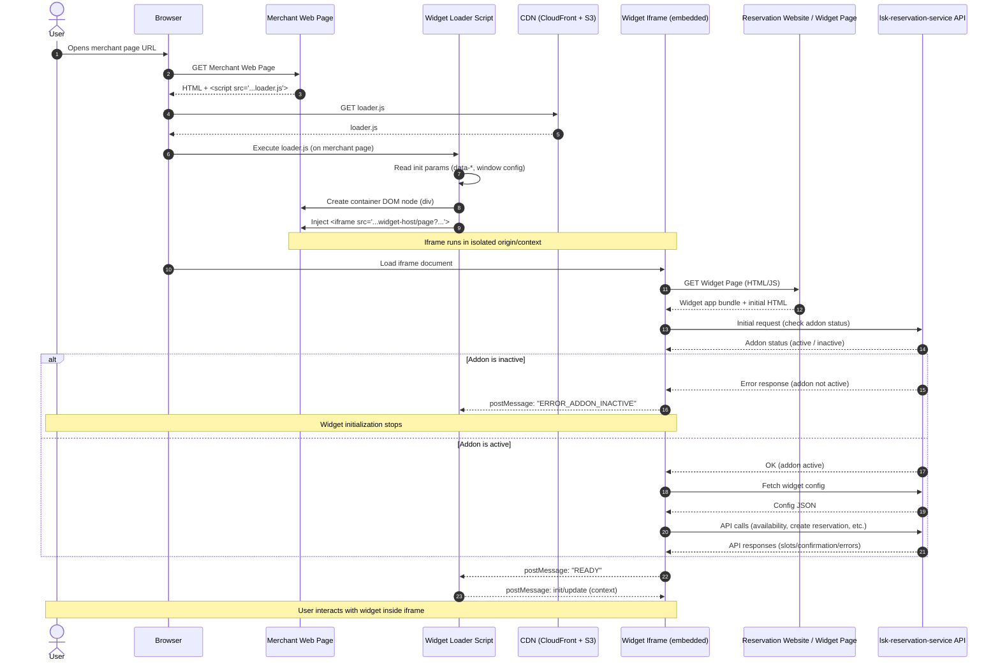
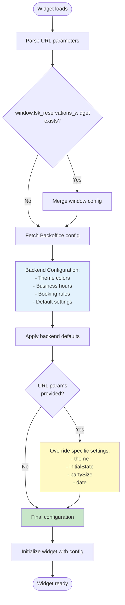

# 80. Lightspeed Reservation Widget

**Owner(s):**

- Vladislav Khripkov, Andrei Kim

**Created:** 2026-02-12

**Status:** Draft

## What are you trying to solve?

Guests want a simple way to book reservations directly from the merchant website without leaving the page. The current process involves redirecting to our reservation site (`lightspeed.app/reservation/{merchant-id}`), which creates several problems:

- **High drop-off rates**: Users abandon the booking flow when redirected to external sites
- **Fragmented user experience**: Breaking the merchant's website flow reduces conversion. It also increse time for booking flow
- **Competitive disadvantage**: Competitors like OpenTable, Resy, and SevenRooms offer embeddable widgets

Merchants are currently using third-party reservation widgets because we don't provide an embeddable solution. This proposal aims to provide an embeddable widget that keeps users on the merchant's website throughout the entire booking flow.

## What are you proposing?

We will develop a customizable, embeddable JavaScript widget that merchants can easily integrate into their websites. This widget will communicate with our existing Reservation API to check availability and process bookings.

### Key Features

- **Booking Form**: A simple, multi-step form for guest information
- **Instant Confirmation**: Immediate booking confirmation with email notification
- **Customization**: Merchants can configure widget appearance and behavior
- **Responsive Design**: Works seamlessly on desktop and mobile devices
- **Accessibility**: WCAG 2.1 AA compliant for inclusive user experience

### Technical Decisions

Based on analysis of competitor solutions (OpenTable, Resy, SevenRooms, TheFork) and technical feasibility, we've chosen:

- **Delivery Method**: Iframe pointing to a new widget-specific page
- **Configuration**: Hybrid approach (backend defaults + URL query parameter overrides)
- **Browser Support**: Modern browsers (Chrome, Firefox, Safari, Edge - last 2 versions), mobile responsive, WCAG 2.1 AA compliant

### Widget Delivery

**Chosen Approach: Embedded Widget via Loader Script (Iframe-based)**

The widget will be delivered in two parts:

1. **Loader Script**: A lightweight JavaScript file hosted on our CDN (S3 + CloudFront)
2. **Widget Application**: An iframe pointing to a new widget-specific page

**Implementation:**

Merchants will add a single async script tag to their website:

```html
<script async src="https://reservations.lightspeedhq.com/widget-loader.js" data-venue-id="123"></script>
```

The loader script will:

1. Create an iframe pointing to `https://reservations.lightspeedhq.com/reservation/{venue-id}/widget`
2. Inject the iframe into the merchant's page
3. Provides an API for interacting with the iframe via postMessage. For example, customization elements or subscription to events inside the iframe.

With the async/defer property, we would not interrupt the customer's website, as some of them care about website performance.

Using `data-*` attributes on the script tag will help with caching (instead of using query params).

**Why Iframe Approach:**

- **Security**: Better isolation between merchant site and widget (no XSS risks)
- **Faster Development**: Reuses existing reservation infrastructure
- **Easier Maintenance**: Widget updates don't require merchant code changes, we release changes for reservation guest website and for widget at the same time
- **Proven Pattern**: Used successfully by competitors (OpenTable, TheFork, Zenchef)
- **Easy to install**: Merchant only need to add single line of code on their website

### System Architecture



### Configuration

**Chosen Approach: Hybrid Configuration (Backend Defaults + `data-*` attributes overrides)**

Configuration follows a layered approach:

1. **Backend Configuration (Primary)**: Merchants configure default settings in Backoffice
   - Theme colors and branding
   - Business hours and booking rules
   - Default party size options
   - Custom messaging and terms

2. **`data-*` attributes**: Merchants can override specific settings per page
   - `venueId` (required): Identifies the merchant venue
   - `other`

**Examples:**

Basic integration (all settings from backend):

```html
<script src="https://reservations.lightspeedhq.com/widget-loader.js" data-venue-id="123"></script>
```

Advanced: Using JavaScript object for complex configuration:

```html
<script>
  window.lsk_reservations_widget = {
    venueId: 123,
    theme: "dark",
    initialState: "open",
    onBookingComplete: function (booking) {
      console.log("Booking completed:", booking);
    },
  };
</script>
<script src="https://reservations.lightspeedhq.com/widget-loader.js"></script>
```

**Why Hybrid Approach:**

- **Easy for most merchants**: Just copy-paste script tag, all settings managed in Backoffice
- **Flexible for advanced use cases**: Can override per page (e.g., special events page)
- **Best of both worlds**: Combines simplicity of backend config with power of URL parameters

### Configuration Resolution Flow



**Configuration Priority (Highest to Lowest):**

1. **URL Parameters** - Overrides everything (e.g., `?theme=dark`)
2. **JavaScript Window Object** - Custom configuration via `window.lsk_reservations_widget`
3. **Backoffice Settings** - Default configuration set by merchant
4. **System Defaults** - Fallback if nothing specified

### Access Control and Licensing

**Addon Requirement**

The reservation widget is only available to merchants who have purchased the reservation addon:

- **License Verification**: Widget loader checks if merchant has active reservation addon
- **Backend Validation**: `lsk-reservation-service` validates addon status via `activation-manager`

**License Check Flow:**

1. Widget page loads with `venueId` parameter
2. Backend checks addon status for business location
3. If addon active → Load widget normally
4. If addon inactive or expired → TBD

### Security

**Domain Validation**

To prevent unauthorized widget usage on non-merchant domains:

1. **Allowed Domains List**: Merchants configure allowed domains in Backoffice (e.g., `example.com`, `www.example.com`)
2. **Backend Validation**: Widget page checks `Referer` header against allowed domains
3. **Fallback**: If validation fails, display error message: "Widget not authorized for this domain"

**Ad Blocker Compatibility**

- **URL Naming**: Use generic, non-tracking-like paths to avoid ad blocker filters
- **Detection**: Loader script includes fallback detection to display message if blocked
- **Graceful Degradation**: If widget fails to load, show direct link to reservation page

### Analytics

**Widget Usage Tracking**

The system will track key metrics to measure widget effectiveness:

**Implementation Methods:**

1. **Client-Side Detection**: Widget JavaScript detects iframe context

```javascript
const isEmbedded = window.self !== window.top;
// Send analytics event with context
```

## Dependencies

**Internal Systems:**

- **lsk-reservation-service** (RFC 0070): Primary backend for availability checks and booking creation
  - API endpoints: `/available-timeslots`, `/reservations` (POST)
  - Real-time availability calculation
  - Booking confirmation and email notifications

- **activation-manager**: Addon license verification service
  - Validates if merchant has active reservation addon
  - Returns addon status (active/inactive/expired)
  - Widget checks addon status before loading booking functionality

- **Reservation Website**: Widget-specific pages served from existing reservation frontend
  - New route: `/reservation/{venue-id}/widget`
  - Reuses existing React components and styling system
  - Responsive layout optimized for iframe embedding

- **CDN (CloudFront + S3)**: Hosts loader script and static assets
  - Global distribution for low latency
  - Versioned assets for cache control
  - Fallback to primary region if CDN fails

- **Backoffice**: Configuration interface for merchants
  - Widget settings page (theme, behavior, allowed domains)
  - Installation instructions and code snippets
  - Analytics dashboard
  - Addon subscription management

**External Systems:**

- None directly, but widget operates within merchant websites (external to our infrastructure)

## Alternatives Considered / Prior Art

### Alternative 1: Direct Widget Injection (No Iframe)

**Description:**
Loader script downloads widget JavaScript and injects directly into merchant page (similar to chat widgets like Intercom).

**Pros:**

- More flexible UI integration
- Better performance (no iframe overhead)
- Easier communication with merchant page

**Cons:**

- **Security Risk**: Widget JavaScript runs in merchant domain (XSS vulnerabilities)
- **CSS Conflicts**: Merchant styles can break widget appearance
- **Complex Isolation**: Requires Shadow DOM or strict CSS namespacing
- **Longer Development Time**: Need robust isolation mechanisms

**Decision:** Rejected due to security and complexity concerns.

### Alternative 2: Iframe Pointing to Existing Reservation Page

**Description:**
Iframe points to current reservation page (`/reservation/{venue-id}/reservation`) without modifications.

**Pros:**

- Zero development effort
- Reuses everything that exists today
- Immediate availability

**Cons:**

- **Poor UX**: Existing page not optimized for iframe embedding
- **Navigation Issues**: Full-page navigation doesn't work well in iframe
- **No Widget-Specific Features**: Can't add widget-specific customization
- **Mobile Experience**: Not optimized for small embedded contexts

**Decision:** Rejected - minimal effort but poor user experience.

### Chosen Solution: Iframe with New Widget-Specific Page

Balances security (iframe isolation), development speed (reuse existing infrastructure), and user experience (widget-optimized UI).

## Operations

**Team Ownership:**

The team responsible for reservations will own and maintain the widget. Note: There is currently no clearly defined team structure, and the team responsible may change in the future.

**Regular Processes:**

1. **Merchant Support**
   - **Installation Assistance**: Help merchants install and configure widget
   - **Troubleshooting**: Debug issues with widget display or functionality
   - **Training Materials**: Maintain documentation and video guides
   - **Expected Volume**: Low initially (beta program), scaling with adoption

2. **Monitoring and Maintenance**
   - **Uptime Monitoring**: Alert on widget availability issues
   - **Performance Tracking**: Monitor load times and error rates
   - **Analytics Review**: Weekly review of conversion metrics
   - **Browser Compatibility**: Test new browser versions quarterly

3. **Feature Requests and Improvements**
   - **Merchant Feedback**: Collect and prioritize widget enhancement requests
   - **Competitive Analysis**: Monitor competitor widget features
   - **A/B Testing**: Run experiments on widget UI and flow

**Operational Impact on Other Teams:**

- **Infrastructure Team**: Initial CDN setup and monitoring (one-time)
- **Security Team**: Review before launch (one-time), periodic security audits
- **Customer Support**: Trained on widget installation troubleshooting
- **Marketing Team**: Create merchant communication materials

**Monitoring and Alerts:**

- Widget load success rate (alert if < 99%)
- Booking completion rate via widget (alert if drops > 10%)
- API response times for widget endpoints (alert if p95 > 2s)
- CDN health and failover status

## Risks

### Technical Risks

**1. Performance / Latency**

**Risk:** Widget loading or API calls could slow down merchant websites, leading to merchant complaints and removal.

**Impact:** High - Slow widgets damage merchant experience and harm adoption

**Mitigation:**

- Implement aggressive caching for availability lookups (5-minute TTL)
- Use global CDN (CloudFront) for widget assets (< 100ms load time target)
- Lazy-load widget iframe (only when user scrolls into view)
- Async script loading (non-blocking)
- Performance budget: Widget < 50KB gzipped, load time < 2s on 3G

**2. Browser and Device Compatibility**

**Risk:** Widget may not work correctly across different browsers, devices, or CMS platforms (WordPress, Shopify, Wix).

**Impact:** Medium - Limits merchant adoption if widget breaks on popular platforms

**Mitigation:**

- Browser support: Modern browsers (Chrome, Firefox, Safari, Edge - last 2 versions)
- Responsive design: Mobile-first approach
- Testing matrix: Test on top 5 CMS platforms before launch
- Graceful degradation: Show direct link if widget fails to load
- Extensive QA across devices and browsers during beta phase

**3. Ad Blocker Interference**

**Risk:** Ad blockers may prevent widget from loading (blocking tracking scripts).

**Impact:** Medium - Reduced functionality for users with ad blockers

**Mitigation:**

- Use generic, non-tracking-like file names (`widget-loader.js`, not `analytics.js`)
- Detection script displays message: "Please disable ad blocker to book reservation"
- Fallback to direct reservation link
- Monitor blocked load rate in analytics

### Security and Privacy Risks

**4. Data Privacy and PII Handling**

**Risk:** Widget handles guest personal information (name, email, phone). Data breach or mishandling could violate GDPR/CCPA.

**Impact:** Critical - Legal liability, reputational damage

**Mitigation:**

- HTTPS only for all widget traffic
- Strict CORS policies (allowed domains only)
- No PII in URL parameters (POST requests only)
- Security review by Security Team before launch
- GDPR/CCPA compliance review
- Short-lived session tokens (30-minute expiry)

**5. Payment Data Handling**

**Risk:** If widget supports payment deposits in the future, PCI DSS compliance required.

**Impact:** Critical - Legal and financial liability

**Mitigation:**

- **Phase 1 (MVP)**: No payment handling in widget
- **Future**: Use tokenization only (Stripe Elements or similar), never handle raw card data
- PCI DSS compliance review before payment features launched

**6. Unauthorized Domain Usage**

**Risk:** Widget could be embedded on unauthorized domains (competitors, malicious sites).

**Impact:** Medium - Brand damage, potential abuse

**Mitigation:**

- Domain allowlist configured in Backoffice
- Backend validates `Referer` header
- Display error message on unauthorized domains
- Regular monitoring for unauthorized usage

**7. Addon License Bypass Attempts**

**Risk:** Merchants without active reservation addon might attempt to use widget without payment.

**Impact:** Low - Revenue loss if bypass is possible

**Mitigation:**

- Addon status checked on every widget load (with 1-hour cache)
- Backend validation in `lsk-reservation-service` prevents API usage without addon
- Widget displays upgrade prompt if addon inactive/expired
- All booking API endpoints validate addon status server-side
- Cannot be bypassed by manipulating client-side code
- Analytics track addon check failures for monitoring

### Operational Risks

**8. Team Ownership Uncertainty**

**Risk:** No clearly defined team structure. Future team changes could impact maintenance.

**Impact:** Medium - Support and maintenance could suffer

**Mitigation:**

- Document architecture and operational procedures thoroughly
- Create runbooks for common issues
- Ensure knowledge transfer if team changes
- Assign interim ownership to current reservation team leads

**9. Merchant Support Volume**

**Risk:** High support volume for widget installation and troubleshooting could overwhelm support teams.

**Impact:** Medium - Poor merchant experience, slow adoption

**Mitigation:**

- Comprehensive self-service documentation
- Video tutorials for installation
- Beta program to identify common issues before general release
- Train customer support team before launch
- Auto-diagnostic tools in Backoffice (check if widget is installed correctly)

### Business Risks

**10. Low Merchant Adoption**

**Risk:** Merchants may not adopt widget if installation is complex or value proposition is unclear.

**Impact:** High - Project failure if adoption is low

**Mitigation:**

- Beta program with pilot merchants to validate value
- Simple copy-paste installation (single script tag)
- Marketing campaign highlighting benefits
- Success metrics dashboard for merchants (show increased bookings)
- Regular merchant feedback and iteration

**11. Competitive Feature Parity**

**Risk:** Competitors (OpenTable, Resy) have mature widgets with more features.

**Impact:** Medium - May lose competitive advantage

**Mitigation:**

- MVP focuses on core booking flow (fast time to market)
- Iterative improvement based on merchant feedback
- Roadmap for advanced features (table selection, special requests, etc.)
- Leverage existing integration with our POS as differentiator
