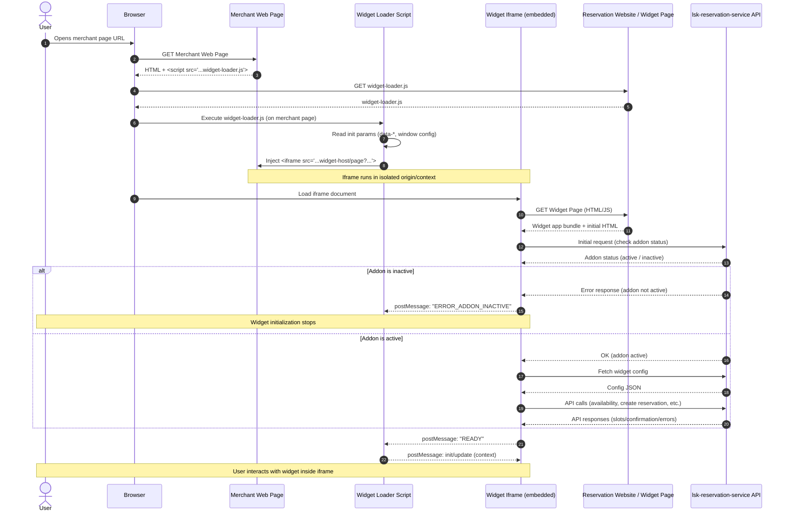

# 80. Lightspeed Reservation Widget

**Owner(s):**

- Vladislav Khripkov, Andrei Kim

**Created:** 2026-02-12

**Status:** Draft

## What are you trying to solve?

Guests want a simple way to book reservations directly from the merchant website without leaving the page. The current process involves redirecting to our reservation site (`lightspeed.app/reservation/{merchant-id}`), which creates several problems:

- **High drop-off rates**: Users abandon the booking flow when redirected to external sites
- **Fragmented user experience**: Breaking the merchant's website flow reduces conversion. It also increase time for booking flow
- **Competitive disadvantage**: Competitors like OpenTable, Resy, and SevenRooms offer embeddable widgets

Currently, merchants are using third-party reservation services and their widgets. Now that we have launched Lightspeed Reservations, we should offer widget functionality. This would make it easier for merchants to switch to our reservation service. This proposal aims to provide an embeddable widget that keeps users on the merchant's website throughout the entire booking process.

## What are you proposing?

We will develop a customizable, embeddable JavaScript widget that merchants can easily integrate into their websites. This widget will communicate with our existing Reservation API.

### Key Features

- **Booking Form**: A simple, multi-step form for guest information
- **Instant Confirmation**: Immediate booking confirmation with email notification
- **Customization**: Merchants can configure widget appearance and behavior
- **Responsive Design**: Works seamlessly on desktop and mobile devices

### Technical Decisions

Based on analysis of competitor solutions (OpenTable, Resy, SevenRooms, TheFork) and technical feasibility, we've chosen:

- **Delivery Method**: loader script, that injects an iframe pointing to a new, widget-specific page
- **Configuration**: Hybrid approach (backoffice defaults + `data-*` attributes overrides)
- **Browser Support**: See 'Browser and Device Compatibility' in Risks section

### Widget Delivery

**Chosen Approach: Embedded Widget via Loader Script (Iframe-based)**

The widget will be delivered in two parts:

1. **Loader Script**: A lightweight JavaScript file that hosted in public folder of reservation application (e.g. https://order-ahead.sbx.lsk.lightspeed.app/reservation/widget-loader.js)
2. **Widget Application**: An iframe pointing to a new, widget-specific page

**Implementation:**

Merchants will add a single async script tag to their website:

```html
<script async src="https://order-ahead.sbx.lsk.lightspeed.app/reservation/widget-loader.js" data-venue-id="123"></script>
```

The loader script will:

1. Create an iframe pointing to `https://order-ahead.sbx.lsk.lightspeed.app/reservation/{venue-id}/widget`
2. Inject the iframe into the merchant's page
3. Exposes an API for interacting with the iframe via postMessage. For example, customization elements or subscription to events inside the iframe (e.g. open/close widget state).

With the async/defer property, we would not interrupt the customer's website, as some of them care about website performance.

Using `data-*` attributes on the script tag will help with caching (instead of using query params).

If needed, it is also possible to add versioning for the loader script. In this case, the merchant would need to update their script to use the new features.

### Implementation Details

**Loader Script Technology Stack:**
- **Build Tool**: Vite (Library Mode)
- **Language**: TypeScript
- **Target**: ES2015 (Compatible with 96%+ of global browsers).

**Widget Technology Stack:**
- The same as the existing reservation app.

**Why Iframe Approach:**

- **Security**: Better isolation between merchant site and widget (no XSS risks)
- **Faster Development**: Reuses existing reservation infrastructure
- **Easier Maintenance**: Widget updates don't require merchant code changes, we release changes for reservation guest website and for widget at the same time
- **Proven Pattern**: Used successfully by competitors (OpenTable, TheFork, Zenchef)
- **Easy to install**: Merchants only need to add a loader script. No need to manage configuration and settings of iframe element

### System Architecture



### Configuration

**Chosen Approach: Hybrid Configuration (Backend Defaults + `data-*` attributes overrides)**

Configuration follows a layered approach:

1. **Backend Configuration (Primary)**: Merchants configure default settings in Backoffice
   - Theme colors and branding
   - Business hours and booking rules
   - Default party size options
   - Custom messaging and terms

2. **`data-*` attributes**: Merchants can override specific settings per page
   - `merchantId` (required): Identifies the merchant venue
   - `lang` (optional): Default language for widget
   - `other`

**Examples:**

Basic integration (all settings from backend):

```html
<script async src="https://order-ahead.sbx.lsk.lightspeed.app/reservation/widget-loader.js" data-merchantId="123" data-lang="fr"></script>
```

Advanced: Using JavaScript object for complex configuration:

```html
<script>
  window.lsk_reservations_widget = {
    merchantId: 123,
    lang: "fr",
  };
</script>
<script async src="https://order-ahead.sbx.lsk.lightspeed.app/reservation/widget-loader.js"></script>
```

**Why Hybrid Approach:**

- **Easy for most merchants**: Just copy-paste script tag, all settings managed in Backoffice
- **Flexible for advanced use cases**: Can override per page (e.g., special events page)
- **Best of both worlds**: Combines simplicity of backend config with power of `data-*` attributes.

### Configuration Resolution Flow

**Configuration Priority (Highest to Lowest):**

1. **Data Attributes** - Overrides everything (e.g., `data-lang="fr"`)
2. **JavaScript Window Object** - Custom configuration via `window.lsk_reservations_widget`
3. **Backoffice Settings** - Default configuration set by merchant
4. **System Defaults** - Fallback if nothing specified

### Access Control and Licensing

**Addon Requirement**

The reservation widget is only available to merchants who have purchased the reservation addon. `lsk-reservation-service` validates addon status via `activation-manager`

### Security

**Domain Validation**

To prevent unauthorized widget usage on non-merchant domains:

1. **Allowed Domains List**: Merchants configure allowed domains in Backoffice (e.g., `example.com`)
2. **Backend Validation**: Widget page checks `Referer` header against allowed domains
3. **Fallback**: If validation fails, display error message

**Ad Blocker Compatibility**

- **URL Naming**: Use generic, non-tracking-like paths to avoid ad blocker filters
- **Detection**: Loader script includes fallback detection to display message if blocked
- **Graceful Degradation**: If widget fails to load, show direct link to reservation page (or show some warning)

**Preventing Spam**

reCAPTCHA check on final step.

### Analytics

**Widget Usage Tracking**

The widget should emit events (e.g., WIDGET_OPENED, BOOKING_COMPLETED) that the Loader Script catches and fires a callback function the merchant can hook into. This will allow merchants to collect some analytics (e.g. they could use Google Analytics and want to track booking on a website).

**Key metrics for widget**:

- Widget load success rate
- Booking conversion rate
- Time to book
- Error rates

**SEO Implications**:

Content inside an iframe is generally not indexed as part of the parent page. While the form itself doesn't need to be indexed, the metadata does.

The Loader Script should arguably inject [JSON-LD Schema markup](https://developers.google.com/search/docs/appearance/structured-data/intro-structured-data) (RestaurantReservation schema) into the merchant's <head>. This might give the merchant a SEO benefit and adds value to the widget.

### Testing

Enhance existing [reservation-mock](https://github.com/lightspeed-hospitality/reservation-mock) for testing on fleet env. It would be a simple html page where we would inject a loader script and run e2e tests.

### Deployment

**Artifacts**

**Next.js Application** (includes both loader script and widget pages)
   - Loader script: `/public/widget-loader.js` (with caching configuration `Cache-Control: public, max-age=3600, stale-while-revalidate=86400` (1 hour cache, serve stale for 24h on error))
   - Widget page: `/reservation/[venueId]/widget`

**CI/CD Pipeline**

Nothing should change

**Rollback Strategy**

Standard Kubernetes rollback via ArgoCD (revert to previous image)


## Dependencies

**Internal Systems:**

- **lsk-reservation-service** ([RFC 0070](https://github.com/lightspeed-hospitality/tech-docs/blob/main/docs/Decision-Records/RFC/0070-lsk-reservation-service.md)): Primary backend for availability checks and booking creation

- **hospitality-consumer-facing/lsk-reservation-client**: Widget-specific pages served from existing reservation frontend

- **hospitality-platform**: Configuration interface for merchants

**External Systems:**

- None directly, but widget operates within merchant websites (external to our infrastructure)

## Alternatives Considered / Prior Art

### Alternative 1: Direct Widget Injection (No Iframe)

**Description:**
Loader script downloads widget JavaScript and add web component widget directly into the merchant page.

**Pros:**

- More flexible UI integration
- Better performance (often smaller size that leads to faster download)
- Easier communication with merchant page

**Cons:**

- **Security Risk**: Widget JavaScript runs in merchant domain
- **Complex Isolation**: Requires Shadow DOM or strict CSS namespacing
- **Isolation Concerns**: Need robust isolation mechanisms
- **Other**: There are other potential risks because we don't control the environment of the merchant's website

**Decision:** Rejected due to security and complexity concerns.

### Alternative 2: Iframe Pointing to Existing Reservation Page

**Description:**
Iframe points to the current reservation page (`/reservation/{venue-id}/reservation`) without modifications.

**Pros:**

- Less development effort
- Reuses everything that exists today
- Immediate availability

**Cons:**

- **UX optimization for iframe**: Existing page not optimized for iframe embedding
- **No Widget-Specific Features**: Can't add widget-specific customization
- **Mobile Experience**: Not optimized for small embedded contexts
- **Widget and website at the same place**: The logic could become overly complicated because we need to consider all the variations of the website and the widget.

**Decision:** Rejected - minimal effort but poor user experience.

### Chosen Solution: Iframe with New Widget-Specific Page

Balances security (iframe isolation), development speed (reuse existing infrastructure), and user experience (widget-optimized UI).

## Operations

**Team Ownership:**

The team responsible for reservations will own and maintain the widget. Note: There is currently no clearly defined team structure, and the team responsible may change in the future.

**Operational Impact on Other Teams:**

- **Security Team**: Review before launch (one-time), periodic security audits
- **Customer Support**: Trained on widget installation troubleshooting
- **Marketing and Sales Team**: Create merchant communication materials


## Risks

### Technical Risks

**1. Performance / Latency**

**Risk:** Widget loading or API calls could slow down merchant websites, leading to merchant complaints and removal.

**Impact:** High - Slow widgets damage merchant experience and harm adoption

**Mitigation:**

- Lazy-load widget iframe
- Async script loading (non-blocking)
- Performance: Widget small as possible, load time fast as possible even on 3G

**2. Browser and Device Compatibility**

**Risk:** Widget may not work correctly across different browsers, devices, or CMS platforms (WordPress, Shopify, Wix).

**Impact:** Medium - Limits merchant adoption if widget breaks on popular platforms

**Mitigation:**

- Browser support: Modern browsers (Chrome, Firefox, Safari, Edge - last 2 versions)
- Extensive QA across devices and browsers during beta phase

**3. Ad Blocker (or other extensions) Interference**

**Risk:** Ad blockers may prevent widget from loading (blocking tracking scripts) or even rendering.

**Impact:** Medium - Reduced functionality for users with ad blockers

**Mitigation:**

- Use generic, non-tracking-like file names (e.g. `widget-loader.js`, see more examples on [easylist](https://github.com/easylist/easylist). It is used in a number of extensions and browsers such as Adblock Plus, uBlock Origin, AdBlock, AdGuard, Brave, Opera, and Vivaldi) 
- Detection script displays message (e.g. "Please disable ad blocker to book reservation")
- Fallback to direct reservation link
- Monitor blocked load rate in analytics

### Security and Privacy Risks

**4. Data Privacy and PII Handling**

**Risk:** Widget handles guest personal information (name, email, phone).

**Impact:** Critical - Legal liability, reputational damage

**Mitigation:**

- HTTPS only for all widget traffic
- Strict CORS policies (allowed domains only)
- Security review by Security Team before launch
- GDPR/CCPA compliance review

**5. Payment Data Handling**

**Risk:** There are plans for the widget and the reservation website to support payment deposits in the future.

**Impact:** High

**Mitigation:**

- **Phase 1 (MVP)**: No payment handling in widget
- **Future**: TBD

**6. Unauthorized Domain Usage**

**Risk:** Widget could be embedded on unauthorized domains (competitors, malicious sites).

**Impact:** Medium

**Mitigation:**

- Domain allowlist configured in Backoffice
- Backend validates `Referer` header
- Display error message on unauthorized domains
- Monitoring for unauthorized usage

### Operational Risks

**7. Merchant Support Volume**

**Risk:** High support volume for widget installation and troubleshooting could overwhelm support teams.

**Impact:** Medium

**Mitigation:**

- Comprehensive self-service documentation
- Tutorials for installation
- Beta program to identify common issues before general release

### Business Risks

**8. Low Merchant Adoption**

**Risk:** Merchants may not adopt a widget if installation is complex or value proposition is unclear.

**Impact:** High

**Mitigation:**

- Simple copy-paste installation (single script tag)
- Marketing campaign highlighting benefits
- Regular merchant feedback and iteration
